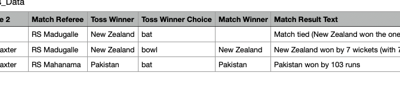

for some reason this never works

from langchain.embeddings import SentenceTransformerEmbeddings

embeddings = SentenceTransformerEmbeddings(model_name="all-MiniLM-L6-v2")

from langchain.embeddings import HuggingFaceEmbeddings

embeddings = HuggingFaceEmbeddings(model_name="all-MiniLM-L6-v2")

all-mpnet-base-v2

who won in the match 'Australia Vs Sri Lanka 3Rd T20I'

problem query

conversational_rag_chain.invoke(
{"input": "who won the toss in those matches"},
config={
"configurable": {"session_id": "session-1"}
}, # constructs a key "abc123" in `store`.
)["answer"]

conversational_rag_chain.invoke(
{"input": "what is the name of the series of that match"},
config={
"configurable": {"session_id": "session-1"}
}, # constructs a key "abc123" in `store`.
)["answer"]

conversational_rag_chain.invoke(
{"input": "when was the first match played"},
config={
"configurable": {"session_id": "session-1"}
}, # constructs a key "abc123" in `store`.
)["answer"]

conversational_rag_chain.invoke(
{"input": "at which city was the first match played"},
config={
"configurable": {"session_id": "session-1"}
}, # constructs a key "abc123" in `store`.
)["answer"]

it fails to give similar type of data
conversational_rag_chain.invoke(
{"input": "which match took place at AMI Stadium"},
config={
"configurable": {"session_id": "session-1"}
}, # constructs a key "abc123" in `store`.
)["answer"]

'According to the context, there were three matches that took place at AMI Stadium:\n\n1. The toss winner chose to bat.\n2. Pakistan won by 103 runs.\n3. New Zealand won by 7 wickets (with 7 balls remaining).\n\nSo, all three matches took place at AMI Stadium in Christchurch, New Zealand.'

