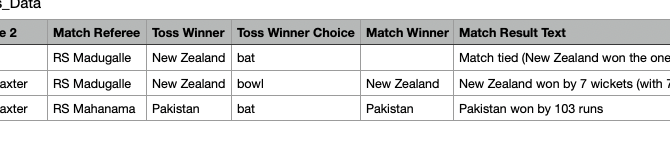

for some reason this never works

from langchain.embeddings import SentenceTransformerEmbeddings

embeddings = SentenceTransformerEmbeddings(model_name="all-MiniLM-L6-v2")

from langchain.embeddings import HuggingFaceEmbeddings

embeddings = HuggingFaceEmbeddings(model_name="all-MiniLM-L6-v2")

all-mpnet-base-v2

who won in the match 'Australia Vs Sri Lanka 3Rd T20I'

problem query

conversational_rag_chain.invoke(
{"input": "which match took place at AMI Stadium"},
config={
"configurable": {"session_id": "session-1"}
}, # constructs a key "abc123" in `store`.
)["answer"]

conversational_rag_chain.invoke(
{"input": "who won the toss in those matches"},
config={
"configurable": {"session_id": "session-1"}
}, # constructs a key "abc123" in `store`.
)["answer"]

conversational_rag_chain.invoke(
{"input": "what is the name of the series of that match"},
config={
"configurable": {"session_id": "session-1"}
}, # constructs a key "abc123" in `store`.
)["answer"]

conversational_rag_chain.invoke(
{"input": "when was the first match played"},
config={
"configurable": {"session_id": "session-1"}
}, # constructs a key "abc123" in `store`.
)["answer"]

conversational_rag_chain.invoke(
{"input": "at which city was the first match played"},
config={
"configurable": {"session_id": "session-1"}
}, # constructs a key "abc123" in `store`.
)["answer"]

it fails to give similar type of data
conversational_rag_chain.invoke(
{"input": "which match took place at AMI Stadium"},
config={
"configurable": {"session_id": "session-1"}
}, # constructs a key "abc123" in `store`.
)["answer"]

'According to the context, there were three matches that took place at AMI Stadium:\n\n1. The toss winner chose to bat.\n2. Pakistan won by 103 runs.\n3. New Zealand won by 7 wickets (with 7 balls remaining).\n\nSo, all three matches took place at AMI Stadium in Christchurch, New Zealand.'

---

when using the below retriever

retriever = vector_store_from_client.as_retriever(
search_type="similarity",
search_kwargs={"k": 4},
)

with the question

retriever.get_relevant_documents("who won the 4th T20I match")

correct results are not coming

---

with similarity search for some queries with lesser limit (k value) correct documents are not getting retrieved, with higher limit correct documents are getting retrieved but llm is failing due to large context

possible solutions

- find a new retriever
- increase the model size

---

trying with increased model size llama-3.1:70b

didn't work as my RAM is less (16gb) and llama:3.1:70b at-least requires 32gb +

---

trying with different model gemma2b:9b

didn't work as the model just gave summary of the context, rather than answering the question

---

trying with different model mistral

sometimes it gave correct answer and sometimes it did not, even after having correct data in the context

---

HAVING LESS CONTENT IN PAGE CONTENT AND APPROPRIATE DATA IN META DATA SEEMS TO PROVIDE CORRECT DATA AND ALSO USING VECTOR AS RETRIEVER INSTEAD OF SELF AWARE RETRIEVER

IT'S USING GPU

- TEST BY TRYING PROBLEM QUERIES ABOVE

---

use mistral-nemo and see the changes - didn't work when embedding with date, try with english sentences
use faiss vector db instead of chroma and see
use llama3:instruct and see the changes
use similarity search by relavance score
use

            docsearch.as_retriever(
                search_type="mmr",
                search_kwargs={'k': 6, 'lambda_mult': 0.25}
            ) - not working accurately

            docsearch.as_retriever(
                search_type="similarity_score_threshold",
                search_kwargs={'score_threshold': 0.8}
            ) - not working accurately

            # Only get the single most similar document from the dataset
            docsearch.as_retriever(search_kwargs={'k': 1}) - not working accurately

            # Use a filter to only retrieve documents from a specific paper
            docsearch.as_retriever(
                search_kwargs={'filter': {'paper_title':'GPT-4 Technical Report'}}
            ) - not working accurately
        """

---

use splitting - not working that well

---

embed
date - for date, it's difficult to embed
place (stadium,city,country) separately and check

---

use csv to statement conversion and check similarity to solve queries like in which match did india score 160 runs - not working

---

mistral is not helping one bit in this csv of t20 matches

---

**mistral-nemo single queries works on meta data but history aware queries works on embeddings**
need to find out why - nothing like this, query basically works on embeddings (page_content)

---

find out how to find the context length

---

why is results of with history and without history different

---

merge two models to get more accurate output if not possible merge to get better english output

---

check the storage used in db

---

queries like conversion rate is 50% and conversation rate of 50% makes a lot of difference

---

# Strategies to Improve Retrieval:

Synonym Expansion: Preprocess your queries to include multiple phrasings (e.g., "Conversion Rate is 50%", "Conversion Rate: 50%"). This can help improve the chances of retrieving relevant documents.
Embedding Aggregation: Consider averaging embeddings from multiple phrasings of the same query. This could create a more robust query vector that captures different ways of expressing the same concept.
Preprocessing: You might preprocess the text in both documents and queries to normalize punctuation or rephrase certain expressions consistently.

---

try different retrievers
improve retrieval by updated the query in the similar format of the page content
try with different embedding model
improve prompt

---

trying with ParentDocument retriever
model user - llama3.1 and mistral-nemo 1. individual questions gave right answers majority of the times, without history 2. with history all questions failed [reason- seems like we might need to formulate a different query for retriever using an llm, than just directly passing the query from the user]

---

trying with MultiQuery retriever

individual key words that are part of the page content works, if given a large query it fails

---
